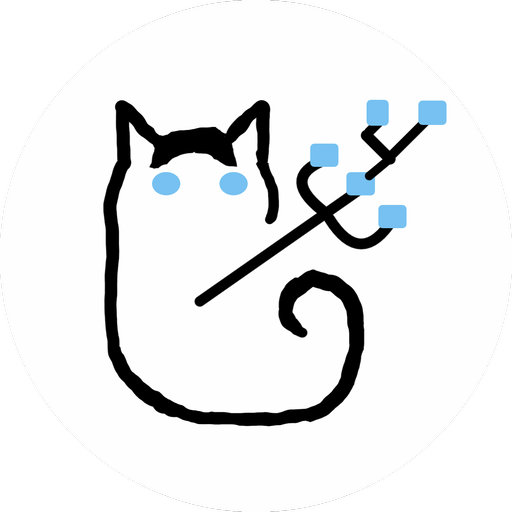

# 概要
これはTODO管理ツール。
まだ開発途中なのでバグだらけ。

# Overview
This is a TODO management tool. It's still under development, so it's full of bugs.

# 特徴
- タスクの依存関係を可視化
- マウス操作があんまりない
- ローカルで完結
- データをjsonファイルで保存しているので、頑張ればvscodeとかでも見られる

# Features
- Visualizes task dependencies
- Minimal mouse interactions required
- Self-contained locally
- Data is saved in JSON files, so with some effort, it can be viewed in VSCode or similar editors

# 使い方
## タスクの新規作成
- n押す
- タイトルとか入力したらCtrlとかと一緒にEnter押す

**注意**
フォーカス外すのにマウス使ったりするとバグるかもw。
マウスはあんまり使わない方が吉。

## タスクの編集
- タスクの上に書いてある文字を順番に入力して、タスクを選択
- eを押す
- 編集しよう
- おわたらctrlとかと一緒にEnter押す

## タスクの削除(タスクを無かったことにする)
- タスクを選択する
- xを押す

## ステータス
タスクにはステータスが設定できる。
WorkingとPendingとDoneがあるよ。

**注意**
1人のUserが並行処理することはできない想定だよ。つまりWorkingは1人のUserにつき、1つしか設定できないよ。

## タスク同士の依存関係
タスクには依存関係が設定できる。
循環させるのはできないよ。
- タスクを選択する
- eを押す
- SourcesとかTargetsに他タスクの名前を入力して選択する

## フィルター
タスクはDoneにしても見えなくなったりしない。
Doneのタスクを見たくないときはf:Filterを押して、StatusにNot Doneを設定してみてね。
他の要素でもフィルターできるよ。
以下がおすすめの使い方。
- とりあえずStatusにNot Doneを設定
- 依存関係のTop(最終的にやりたいこと)を一覧表示したい->TargetsにNoneを設定
- タスクAが依存してるタスクを全部みたい->TargetsにAを設定

## 他View
タスクの見え方を変えられるよ。
- e:Change Viewを押す
- 適当なviewを選択

viewの簡単な説明
- Graph: 依存関係が見える
- Tile: 一覧表示
- Gantt: startとendでガントチャート表示
- TimeLine: 開発中w

## Sidebar
サイドバーを開くと自分がAssignされていて、Doneではないタスク一覧が見えるよ。
開き方はbを押すだけだよ。
一番上が一番優先度高いタスク(Working中)だよ。
ここ結構バグってて絶対一番上がWorkingになるはずなんだけどならないこともあるよw。
優先度変えたかったら左とか右矢印入力したら変えられるはず。でもバグってて変わんないときもあるw。
依存関係的に優先度変えられないときもあるよ。これはバグじゃないよ。

# 開発者向け/For developers
# build
npm run tauri build

# run dev
npm run tauri dev

This software is released under the MIT License, see LICENSE.txt.